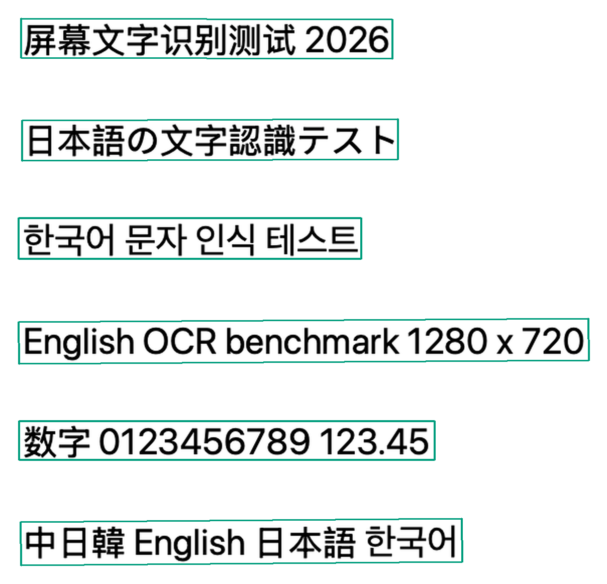
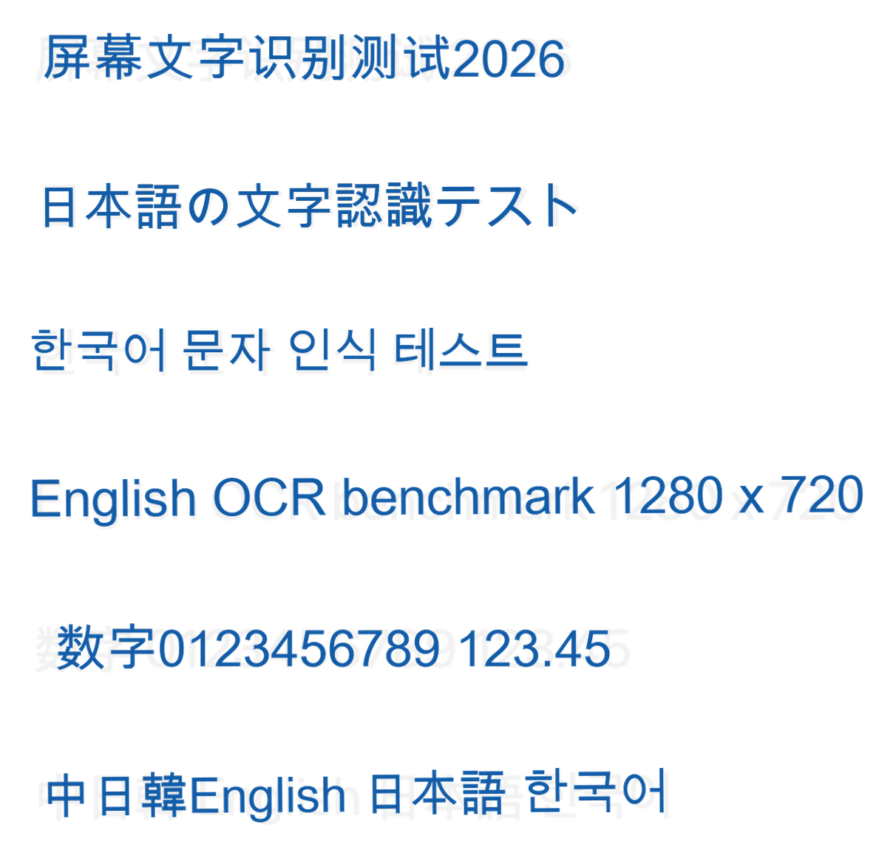
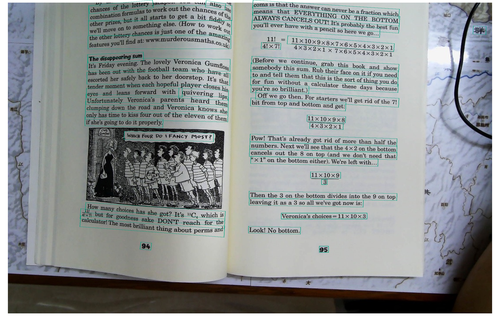
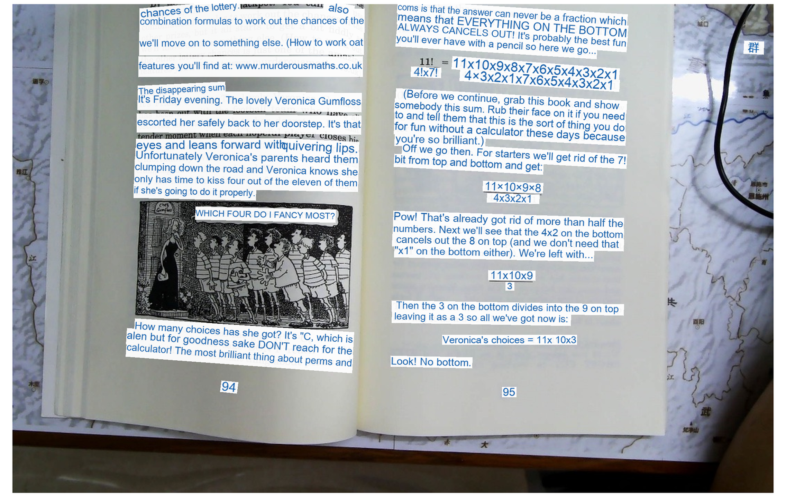
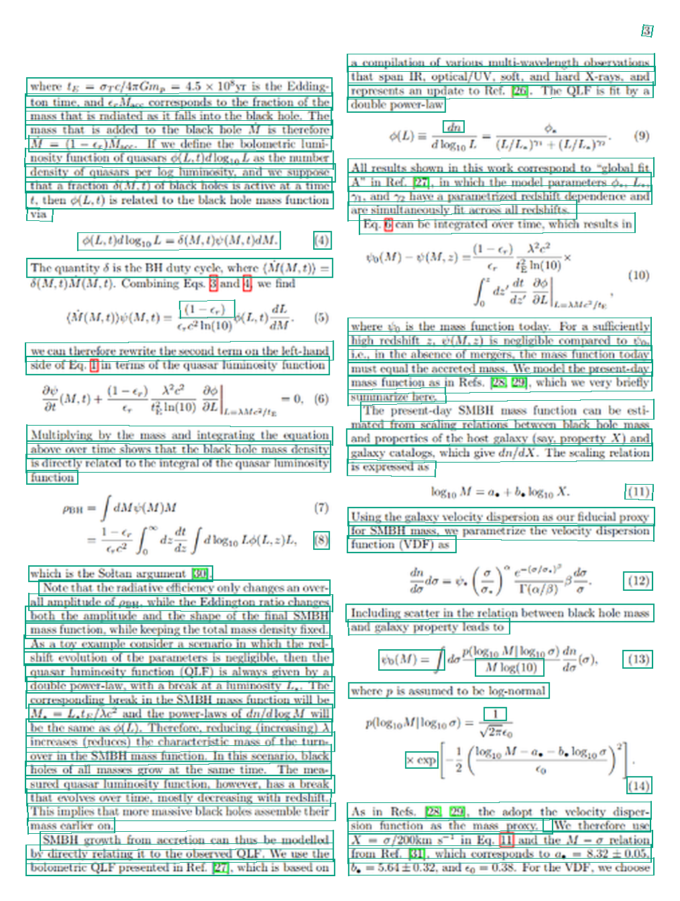
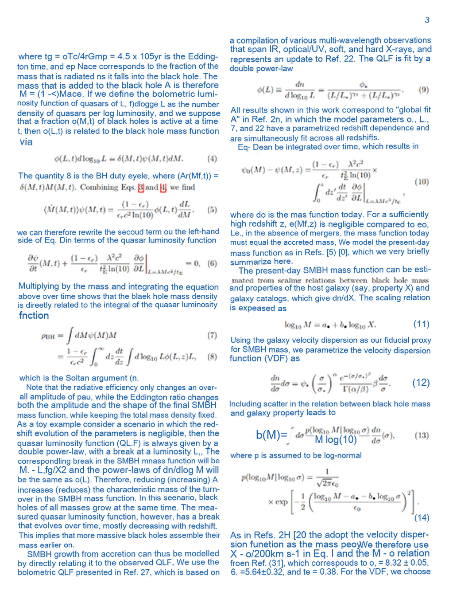
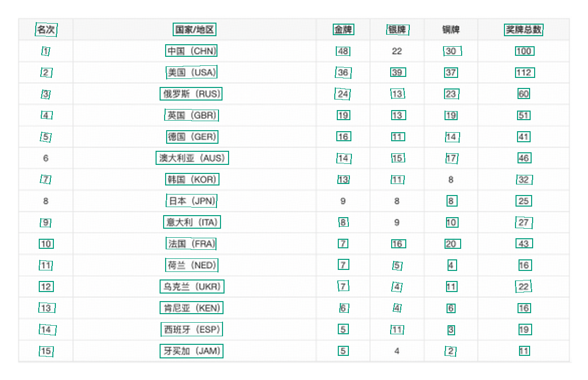
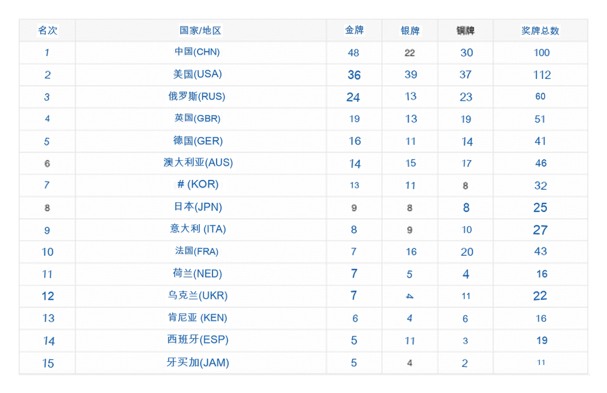

# oneocr-native

[简体中文](README.md) | [English](README.en.md) | [日本語](README.ja.md)

离线识别中文、日文、韩文和英文，提供 Go、C/C++、Python 与 Android 接口。

## 下载

[GitHub Releases · Latest](https://github.com/shiyori/oneocr-native/releases/latest)

| 平台 | 完整版（推荐） |
|---|---|
| Android arm64-v8a / x86_64 | [完整 AAR](https://github.com/shiyori/oneocr-native/releases/latest/download/oneocr-android.aar) |
| Linux x64 | [完整运行包](https://github.com/shiyori/oneocr-native/releases/latest/download/oneocr-linux-amd64.zip) |
| Linux ARM64 | [完整运行包](https://github.com/shiyori/oneocr-native/releases/latest/download/oneocr-linux-arm64.zip) |

推荐使用包含默认模型和运行库的完整包。Android Core AAR 仅供已有宿主 ORT 的进阶集成，见 [Android 指南](docs/zh-CN/android.md)。Windows/macOS 通过 Go 或 Python 准备完整依赖，不提供平台专属包。

## Go 接入

代码接入使用 `go get github.com/shiyori/oneocr-native@v0.1.2`，详见 [Go 指南](docs/zh-CN/go.md)。命令行接入使用：

```sh
go install github.com/shiyori/oneocr-native/cmd/oneocr@v0.1.2
oneocr install
oneocr recognize image.png
oneocr recognize --format json image.png
```

## Python

```sh
python -m pip install "https://github.com/shiyori/oneocr-native/releases/download/v0.1.2/oneocr_native-0.1.2-py3-none-any.whl"
python -m oneocr_native install
python -m oneocr_native recognize image.png
python -m oneocr_native recognize --format json image.png
```

## 测试结果

OneOCR v0.1.2 对 `testdata` 中四张图片的实际输出。仅展示识别置信度 ≥ **0.80** 且检测分数 ≥ **0.70** 的结果。左图在原图上画框；右图保留原图，在同一位置叠加蓝色识别文字，并加局部浅色底以保持可读性。点击图片可查看高清图。

两张图采用相同裁剪和坐标；外围留白同步裁去，未人工修正识别文字。置信度为未校准模型分数。

### 中日韩英混排

显示 6 / 6 条非空识别结果.

| 原图 + 文本框 | 原图 + 蓝色识别文字 |
|---|---|
| [](docs/assets/ocr-results/mixed-boxes.webp) | [](docs/assets/ocr-results/mixed-text.webp) |

### 实拍书页

显示 46 / 48 条非空识别结果.

| 原图 + 文本框 | 原图 + 蓝色识别文字 |
|---|---|
| [](docs/assets/ocr-results/book-boxes.webp) | [](docs/assets/ocr-results/book-text.webp) |

### 公式文档

显示 76 / 94 条非空识别结果.

| 原图 + 文本框 | 原图 + 蓝色识别文字 |
|---|---|
| [](docs/assets/ocr-results/formula-boxes.webp) | [](docs/assets/ocr-results/formula-text.webp) |

### 中文表格

显示 87 / 89 条非空识别结果.

| 原图 + 文本框 | 原图 + 蓝色识别文字 |
|---|---|
| [](docs/assets/ocr-results/table-boxes.webp) | [](docs/assets/ocr-results/table-text.webp) |

[生成记录与复现方法](docs/assets/ocr-results/README.md) · [样本来源](testdata/paddleocr/README.md) · [第三方许可](testdata/paddleocr/UPSTREAM_LICENSE)

## 接入指南

[下载与安装](docs/zh-CN/installation.md) · [Go 接入](docs/zh-CN/go.md) · [C 与 C++ 接入](docs/zh-CN/native.md) · [Python 接入](docs/zh-CN/python.md) · [Android 接入](docs/zh-CN/android.md) · [已有 ONNX Runtime](docs/zh-CN/runtime.md)

---

[AGPL-3.0-only](LICENSE).
