# PaddleOCR 原图测试结果

[简体中文](../zh-CN/test-results.md) | [English](../en/test-results.md) | [日本語](../ja/test-results.md)

使用公开发布的 OneOCR v0.1.3、默认中日韩英模型，对 `testdata/paddleocr` 中全部 9 张原图重新识别。输入保持原始尺寸，没有转换成 720p。

仅在对照图中展示识别置信度 ≥ **0.70** 且检测分数 ≥ **0.70** 的非空结果；JSON 保留全部识别输出。置信度为未校准模型分数。样本没有完整人工标注，下表数量不代表准确率。

左图在原图上画框，右图在对应位置叠加蓝色识别文字和局部浅色底。两图保留完整画布，按 2 倍尺寸渲染；JSON 坐标对应原图。文字未经人工修正，点击图片可查看大图。

| 原图 | 原始尺寸 | 非空结果 | 展示结果 | 原始 JSON |
|---|---|---:|---:|---|
| [book.jpg](#sample-book) | 1100 × 708 | 44 | 43 | [JSON](../assets/paddleocr-results/book.json) |
| [book_rot180.jpg](#sample-book_rot180) | 1100 × 708 | 46 | 46 | [JSON](../assets/paddleocr-results/book_rot180.json) |
| [doc_with_formula.png](#sample-doc_with_formula) | 816 × 1056 | 116 | 102 | [JSON](../assets/paddleocr-results/doc_with_formula.json) |
| [formula.png](#sample-formula) | 448 × 64 | 6 | 5 | [JSON](../assets/paddleocr-results/formula.json) |
| [medal_table.png](#sample-medal_table) | 550 × 345 | 96 | 96 | [JSON](../assets/paddleocr-results/medal_table.json) |
| [seal.png](#sample-seal) | 640 × 640 | 10 | 6 | [JSON](../assets/paddleocr-results/seal.json) |
| [table.jpg](#sample-table) | 551 × 132 | 12 | 12 | [JSON](../assets/paddleocr-results/table.json) |
| [textline.png](#sample-textline) | 514 × 64 | 1 | 1 | [JSON](../assets/paddleocr-results/textline.json) |
| [textline_rot180.jpg](#sample-textline_rot180) | 429 × 48 | 1 | 1 | [JSON](../assets/paddleocr-results/textline_rot180.json) |

## book.jpg

原始尺寸：1100 × 708；显示 **43 / 44** 条非空结果。

[原图](../../testdata/paddleocr/book.jpg) · [JSON](../assets/paddleocr-results/book.json)

| 原图 + 文本框 | 原图 + 蓝色识别文字 |
|---|---|
| [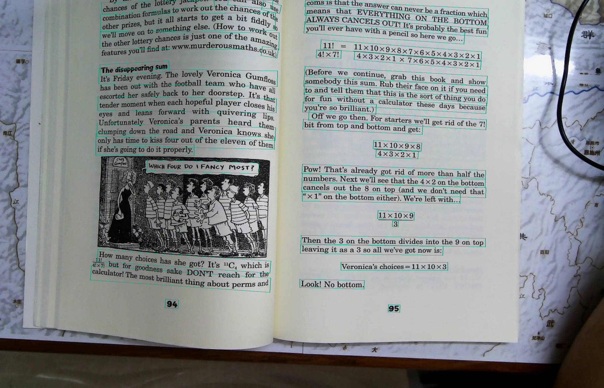](../assets/paddleocr-results/book-boxes.webp) | [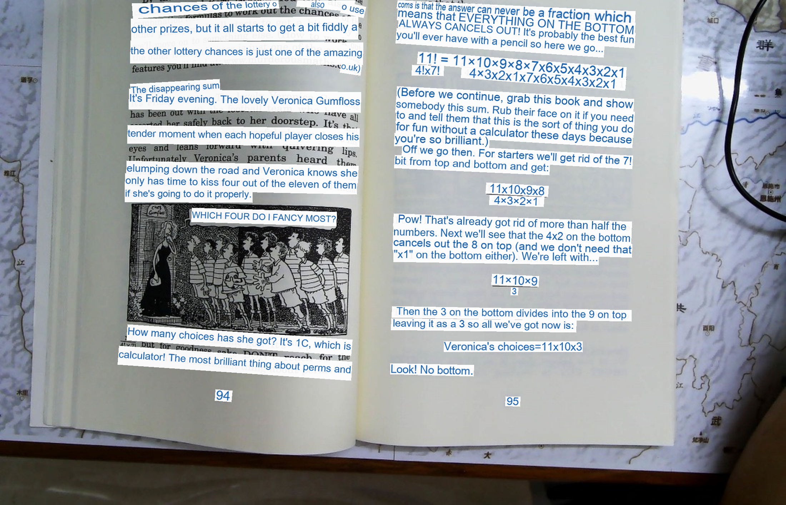](../assets/paddleocr-results/book-text.webp) |

## book_rot180.jpg

原始尺寸：1100 × 708；显示 **46 / 46** 条非空结果。

[原图](../../testdata/paddleocr/book_rot180.jpg) · [JSON](../assets/paddleocr-results/book_rot180.json)

| 原图 + 文本框 | 原图 + 蓝色识别文字 |
|---|---|
| [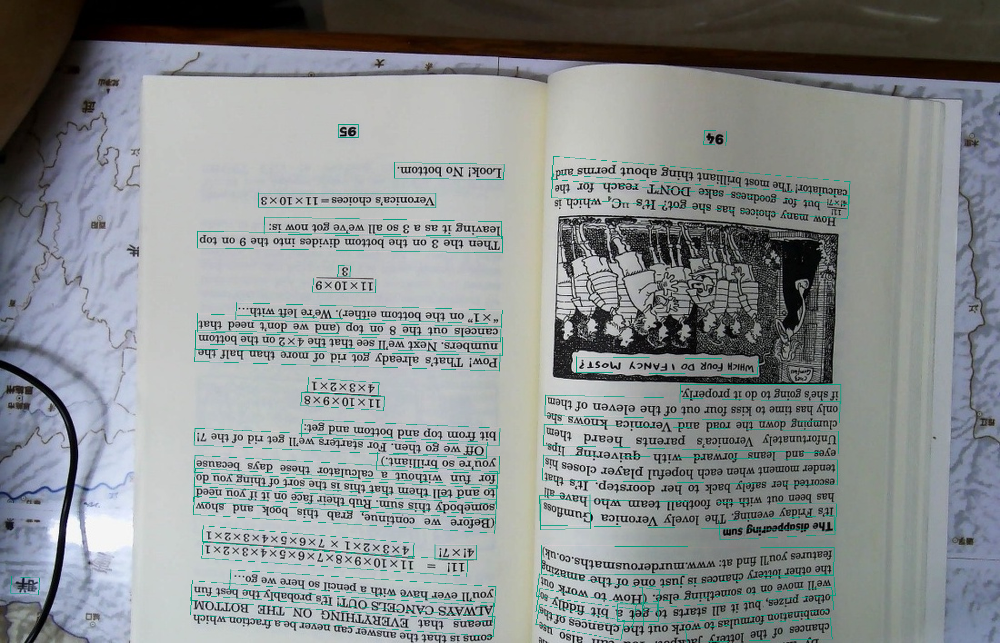](../assets/paddleocr-results/book_rot180-boxes.webp) | [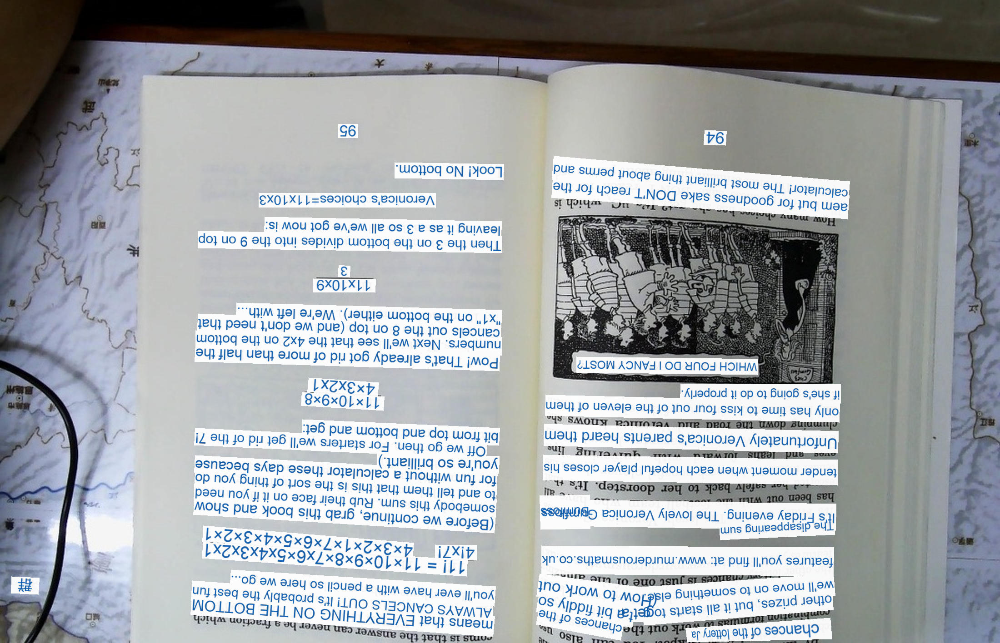](../assets/paddleocr-results/book_rot180-text.webp) |

## doc_with_formula.png

原始尺寸：816 × 1056；显示 **102 / 116** 条非空结果。

[原图](../../testdata/paddleocr/doc_with_formula.png) · [JSON](../assets/paddleocr-results/doc_with_formula.json)

| 原图 + 文本框 | 原图 + 蓝色识别文字 |
|---|---|
| [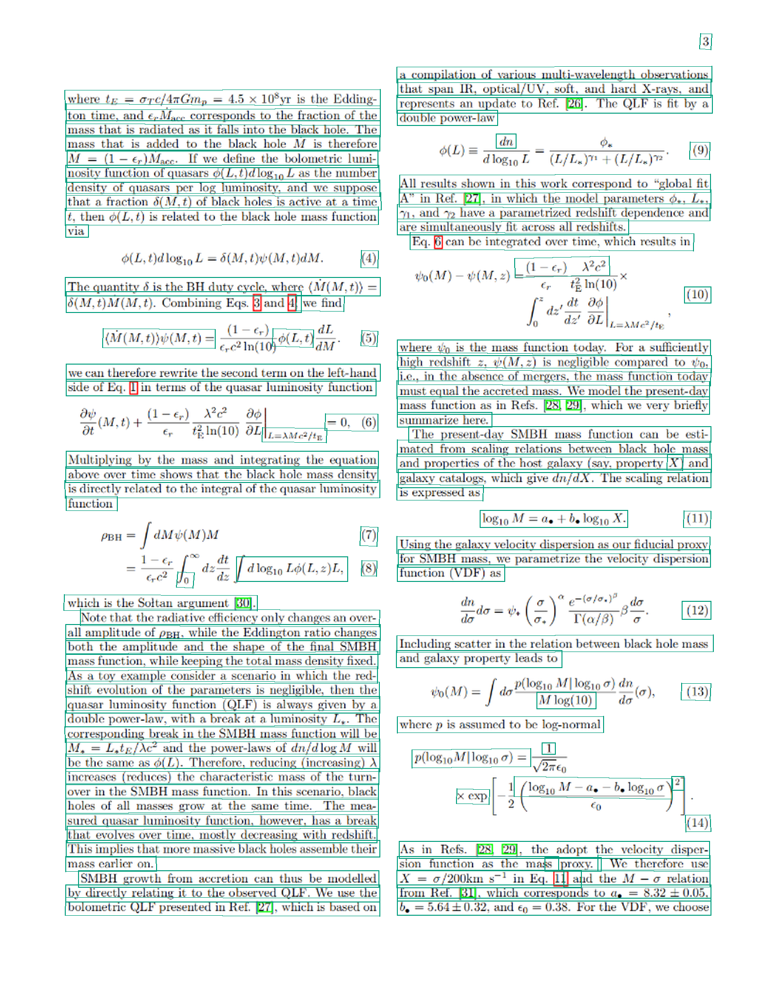](../assets/paddleocr-results/doc_with_formula-boxes.webp) | [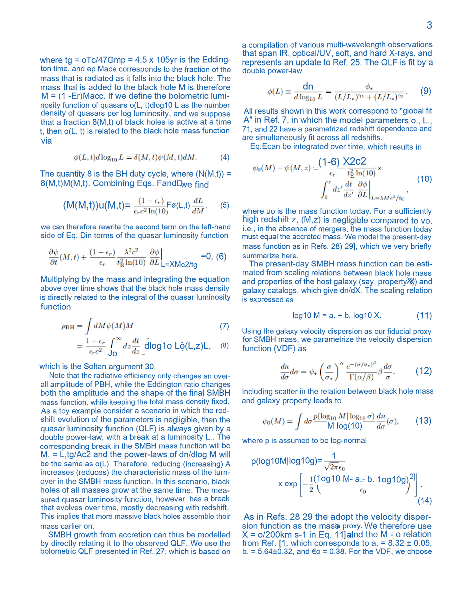](../assets/paddleocr-results/doc_with_formula-text.webp) |

## formula.png

原始尺寸：448 × 64；显示 **5 / 6** 条非空结果。

[原图](../../testdata/paddleocr/formula.png) · [JSON](../assets/paddleocr-results/formula.json)

| 原图 + 文本框 | 原图 + 蓝色识别文字 |
|---|---|
| [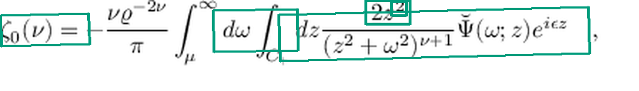](../assets/paddleocr-results/formula-boxes.webp) | [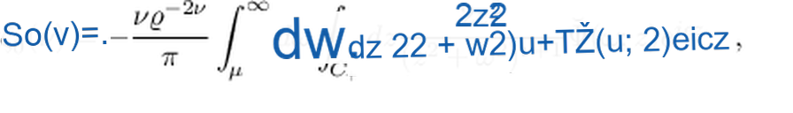](../assets/paddleocr-results/formula-text.webp) |

## medal_table.png

原始尺寸：550 × 345；显示 **96 / 96** 条非空结果。

[原图](../../testdata/paddleocr/medal_table.png) · [JSON](../assets/paddleocr-results/medal_table.json)

| 原图 + 文本框 | 原图 + 蓝色识别文字 |
|---|---|
| [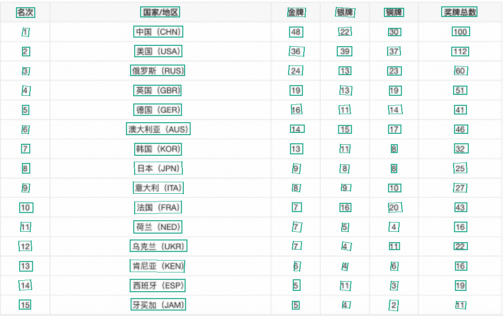](../assets/paddleocr-results/medal_table-boxes.webp) | [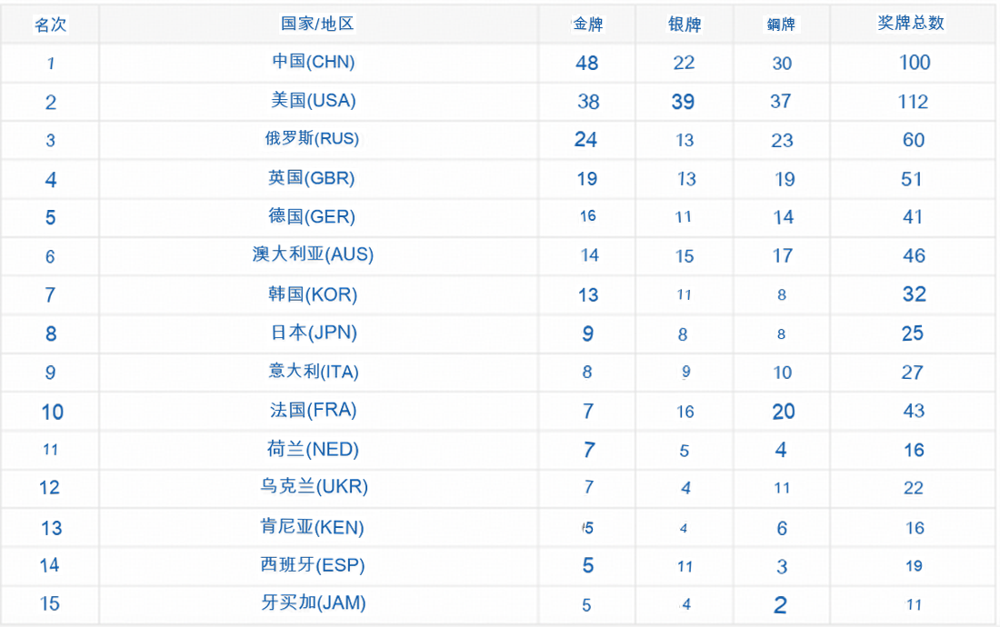](../assets/paddleocr-results/medal_table-text.webp) |

## seal.png

原始尺寸：640 × 640；显示 **6 / 10** 条非空结果。

[原图](../../testdata/paddleocr/seal.png) · [JSON](../assets/paddleocr-results/seal.json)

| 原图 + 文本框 | 原图 + 蓝色识别文字 |
|---|---|
| [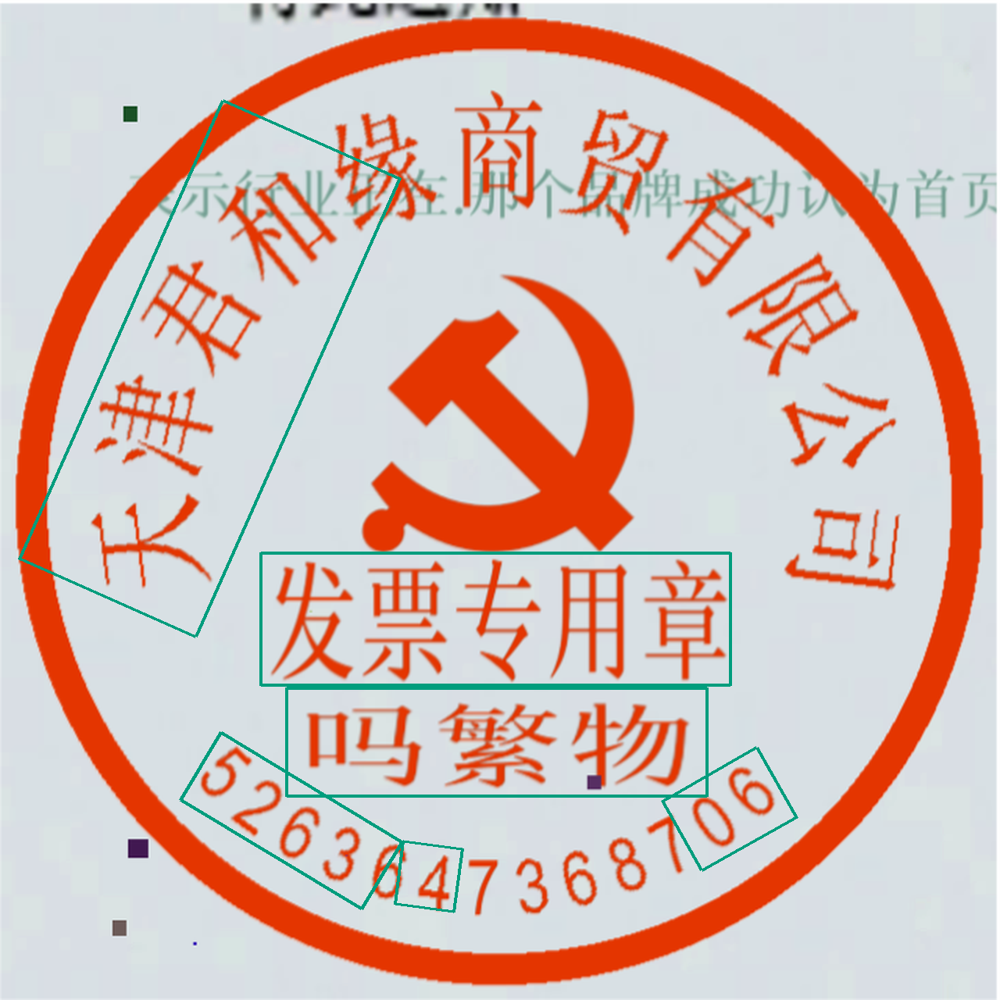](../assets/paddleocr-results/seal-boxes.webp) |  |

## table.jpg

原始尺寸：551 × 132；显示 **12 / 12** 条非空结果。

[原图](../../testdata/paddleocr/table.jpg) · [JSON](../assets/paddleocr-results/table.json)

| 原图 + 文本框 | 原图 + 蓝色识别文字 |
|---|---|
| [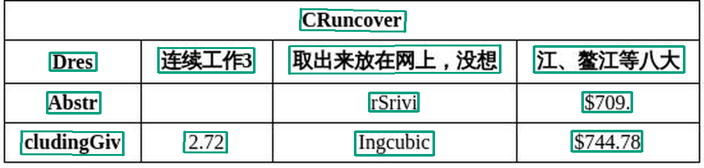](../assets/paddleocr-results/table-boxes.webp) | [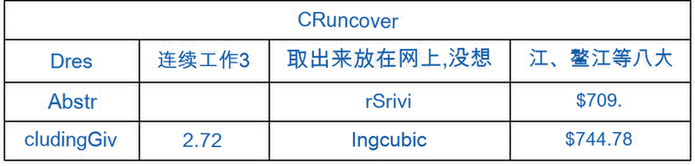](../assets/paddleocr-results/table-text.webp) |

## textline.png

原始尺寸：514 × 64；显示 **1 / 1** 条非空结果。

[原图](../../testdata/paddleocr/textline.png) · [JSON](../assets/paddleocr-results/textline.json)

| 原图 + 文本框 | 原图 + 蓝色识别文字 |
|---|---|
| [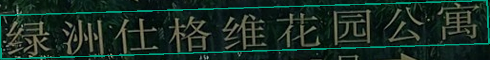](../assets/paddleocr-results/textline-boxes.webp) |  |

## textline_rot180.jpg

原始尺寸：429 × 48；显示 **1 / 1** 条非空结果。

[原图](../../testdata/paddleocr/textline_rot180.jpg) · [JSON](../assets/paddleocr-results/textline_rot180.json)

| 原图 + 文本框 | 原图 + 蓝色识别文字 |
|---|---|
|  |  |

图片来源、固定提交与 SHA-256 见[来源清单](../../testdata/paddleocr/manifest.json)，图片保留上游 [Apache-2.0 许可](../../testdata/paddleocr/UPSTREAM_LICENSE)。

[生成清单](../assets/paddleocr-results/manifest.json) · [复现方法](../assets/ocr-results/README.md) · [主 README](../../README.md)
